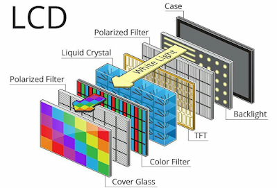
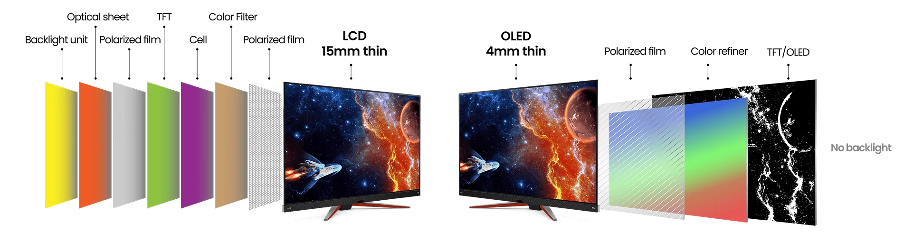
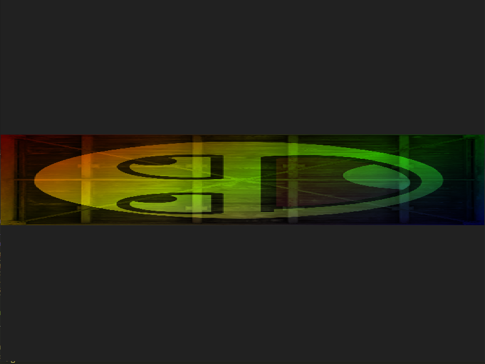
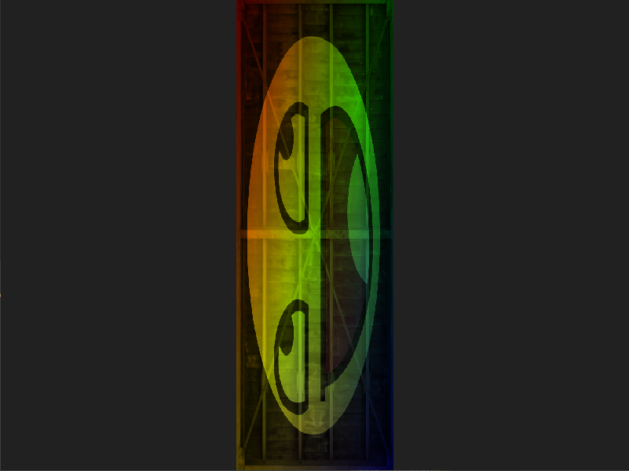

# OpenGL starter code & Study Note
Starter code for OpenGL (including the required libraries) and study note for personal use.  
This study note is not very extensive since I'm not a big fan of making neat notes - I prefer to understand and memorise them.  

It is intended to read the [tutorial](https://learnopengl.com) over and over until I internalise it.  
For UNSW students who happen to find this repo - this is **NOT** a study note for [`COMP3421`](https://www.handbook.unsw.edu.au/undergraduate/courses/2024/COMP3421?year=2024) - I didn't take that course and I don't intend to take it. I wish it taught OpenGL again, though.


### Table of Contents  
[Getting Started](#getting-started)  
[Theory](#theory)   
[OpenGL](#opengl)


# Getting Started
Download [GLFW](#https://www.glfw.org) and [GLAD](https://glad.dav1d.de). For GLAD, set Profile to Core, gl to version 3.3 and click generate.  
Watch this [youtube tutorial](https://youtu.be/XpBGwZNyUh0?si=rgaipn1xYPWQxw4p) for the rest of the step.  

Other libraries are not included as they are not needed to run OpenGL. But you can download them here as well. [stb_image.h](https://github.com/nothings/stb/blob/master/stb_image.h), [GLM](https://glm.g-truc.net/0.9.8/index.html).  
A helper header is also included with can help with specific tasks.

# Theory
Theory is important in programming (and is also the boring part of it). I solely believe you should not just take things as granted.  
Below is the table of contents summarising the findings that might be helpful for learning graphics programming & OpenGL. 
### Table of Contents
* [Displays](#displays)
* [Maths](#maths)
## Displays
### LCD Monitors
LCD stands for `Liquid Crystal Display`. This is a `transmissive` display type meaning it can't emit lights on its own.  
As such, it depends on a back light to emit lights. This back light can be of different types but I won't discuss here.  

How LCD adjusts brightness and colours depends on the liquid crystal encapsulated bewteen two polarised filters.  
These two polarised filters are rotated perpendicular to one another, completely blocking lights from the back light.  
  
Between them there is liquid crystal. Electric field applied by TFT (Thin Film Transistor) to this rotates lights, allowing them to pass through the second polarised filter.  
If lights are rotated such that the second polarised filter has no effect, they are at full brightness. Colour is applied by a colour filter placed before the second polarised filter and after liquid crystal.  
  
  
How light crystal is placed determines the type of LCD monitors. These can be `IPS (In Place Switching)`, `VA (Vertical Alignment)` or `TN (Twisted Nematic)`.  
`IPS` monitors accurately produce colours and also have better viewing angle than `TN` monitors. As oppose to those, `TN` monitors have faster response time and refresh rate. `VA` monitors are the middle of the two (Take this with a grain of salt. My main monitor is VA and second IPS. I don't own a TN monitor).  

---
### LED & OLED monitors
If your monitor is a LED monitor, chances are it's actually a LCD monitor with the back light being arrays of LEDs. LED stands for `(Inorganic/ Organic)Light Emitting Diode`. If it's organic, then it's `OLED` (**I don't know the difference between the two as of yet**).  
  
As you might guess from how `LED` monitors actually work, `LED` monitors are actually a subset of LCD monitors hence they are `transmissive`. But, `OLED` monitors are `emissive` - They don't rely on back light. They produce lights by themselves.  

  
As the [picture](https://www.benq.com/en-us/knowledge-center/knowledge/oled-monitor.html#:~:text=Both%20have%20the%20same%20pixel,OLED%20has%20essentially%20infinite%20contrast.) above suggests, they don't need multiple layers unlike LCD monitors. Hence, OLED monitors are much thinner than them.  
Colours and contrast are far more vivid and brightness is superior - Instead of relying on two polarisers, just completely shut them off.  
However, OLED monitors are quite expensive since they are still relatively new.

---
## Maths
This is primarily a summary note of [MIT 18.04 lectures from 2005](https://www.youtube.com/playlist?list=PLE7DDD91010BC51F8) as well as its book. Other findings that help learn OpenGL and the underlying maths is also included.  

Hereafter `lectures` refers to `MIT 18.04 lectures from 2005`.

* [Preface](#preface)

## Preface
This section is equivalent to lectures 1 ~ 4 and a bit of 5, too. Also a bit of how OpenGL interprets data.  

---

### Matrix Interpretation
Professor Gilbert Strang (Lecturer of MIT 18.04) provides us with a new perspective to interpret matrix multiplication. What I find the most helpful is the `row interpretation` - You are multiplying one row at a time, as opposed to multiplying matrices (or matrix * vertex) one entry at a time.  

$`\small \begin{bmatrix}1 & 2 & 3 \\ 4 & 5 & 6 \\ 7 & 8 & 9 \end{bmatrix}\times \begin{bmatrix} a \\ b \\ c \end{bmatrix} `$ 
is interpreted as 
$`\small \begin{bmatrix}R_1 \\ R_2 \\ R_3\end{bmatrix} \times \begin{bmatrix} a \\ b \\ c \end{bmatrix} = \begin{bmatrix} R_1 \cdot (a, b, c) \\ R_2 \cdot (a, b, c) \\ R_3 \cdot (a, b, c) \\  \end{bmatrix} `$. This is the **row way** to interpret matrix multiplication.   

First row is $\small \begin{bmatrix} 1 & 2 & 3 \end{bmatrix}$. Dot product of this with $\small \begin{bmatrix} a & b & c \end{bmatrix}$ gives you the first row of matrix * vector.  
This is really just saying " I want `1 of a`, `2 of b` and `3 of c` summed all together for my first row".  

With this concept firmly grapsed in your mind, it's easy to verify & perform matrix multiplication of any size.  
$`\small \begin{bmatrix} 2 & 7 & 4 \\ 1 & 3 & 2 \\ 8 & 0 & 2 \end{bmatrix} \times \begin{bmatrix} 3 & 1 & 1 \\ 9 & 6 & 5 \\ 2 & 3 &8 \end{bmatrix} = \begin{bmatrix} 77 & 56 & 69 \\ 34 & 25 & 32 \\ 28 & 14 & 24 \end{bmatrix} `$  
  
>For the first row, I want `2 of the first row`, `7 of the second row` and `4 of the third row` summed all together!.  

There are more ways to interpret matrix multiplication. These are not included so you can check out Professor Gilbert Strang's lectures.  

---
#### Matrix Multiplication Verification via Row Interpretation
In a similar way you can verify and reason the dimensions of resulting matrix.  
$`\small \begin{bmatrix} 1 & 2 & 3 \\ 4 & 5 & 6 \\ 7 & 8 & 9 \end{bmatrix} \times \begin{bmatrix} 5 & 5 \\ 6 & 6 \end{bmatrix} `$  

> I want `1 of the first row`, `2 of the second row` and `3 of the third row (???)` summed all together for my first entry

This does not make sense at all as the second matrix only has 2 rows. This matrices multiplication is not valid.  
Note that It's not possible to verify every matrix by row interpretation. You will also need to use `column interpretation` to verify all matrices (Watch the lectures!!!!)  

$`\small \begin{bmatrix} 1 & 2  \\ 4 & 5  \\ 7 & 8  \end{bmatrix} \times \begin{bmatrix} 5 & 5 & 5\\ 6 & 6 & 6 \\ 7 & 7 & 7 \end{bmatrix} `$  

> I want `1 of the first row`, `2 of the second row` summed together for my first entry

This statement makes sense although matrix multiplication of `[3, 2]` with `[3, 3]` is not possible. By definition, in order to multiply `matrix A` by `matrix B`, `A` must have the same number of columns as the rows of `B`. The resulting dimensions are `[n, p]` where `n = no. rows in A`, `p = no. cols in B`.  

$`\small A = (n\ by\ m)\ and\ B = (m\ by\ p)\ then\ AB = (n\ by\ p) `$

---
#### Figuring Out Dimensions of AB via Row Interpretation
Row interpretation allows us to subconsciously figure out the resulting dimensions of A*B.

$`\small \begin{bmatrix} 1 & 2 \\ 3 & 4\end{bmatrix} \times \begin{bmatrix} 9 & 9 & 9 \\ 8 & 8 & 8 \end{bmatrix} = \begin{bmatrix} 25 & 25 & 25 \\ 59 & 59 & 59 \end{bmatrix} `$

> I want `1 of the first row` + `2 of the second row` for the first row of AB and `3 of the first row` + `4 of the second row` for the second row of AB. The dimensions of AB must be 2 rows and 3 columns since we want 2 rows and each row of B contains 3 elements.

---
#### Permutation Matrices
We know that Identity Matrix $I$ is an n by n matrix whose diagonals are 1 and everything else 0. Permutation matrices, on the other hand, have similar appearance yet they act differently on matrices. We reason how they act via `row interpretation`.  

$`\small P= \begin{bmatrix}1 & 0 & 0 \\ 0 & 0 & 1 \\ 0 & 1 & 0\end{bmatrix} \times B=\begin{bmatrix} R_1 \\ R_2 \\ R_3\end{bmatrix}\ Here,\ R_n\ represents\ the\ nth\ row\ which\ has\ 3\ elements. `$  
We reason how this multiplication will turn out.

> For the first row, I want the first row of B and nothing else.  
> For the second row, I want the third row of B and nothing else.  
> For the last row, I want the second row of B and nothing else.

After our reasoning, it turns out the resulting matrix PB is going to be 
$`\small \begin{bmatrix} R_1 \\ R_3 \\ R_2 \end{bmatrix} `$, second and third rows swapped. Indeed, permutation matrices are just matrices which want just one specific row of B and nothing else for each entry.  
  
Note that matrix multiplication is not commutative (AB != BA). So PB is not the same as BP. P on the right side will swap columns of B instead.  

---
#### Order of Effects for Matrix Multiplication
In OpenGL, matrix multiplications are reversed. If your code translates first then scales, the output will be scale applied first then translation. We reason this using the properties of matrix multiplication.  

Suppose we have the following Equations  
$`\small M_{t} \cdot M_{s} \cdot x `$.  

Here, $M_t$ is a translation matrix, $`M_s`$ scale matrix and $`x`$ the vector a a vertex.  
Using the associative law (A + B) + C = A + (B + C), we can reason that scale matrix will act on the vector first.  
 
$`\small M_{t} \cdot (M_{s} \cdot x) = M_{t} \cdot x_{scaled} `$.  
And then the translation matrix acts on the vector.  
$`\small M_{t} \cdot x_{scaled} = x_{scaledTranslated} `$  

Since matrix multiplication is not commutative (AB != BA), we cannot multiply $x$ by $`M_t`$ first. This would break the law.  
We observe that matrix a that's adjacent to vector will act on the vector first. However, when we write OpenGL code, we probably do something like this
```cpp
mat4 matrix = mat4.identity();
//Apply Translate matrix
matrix = mat4.translate(matrix);
//Apply scale matrix
matrix = mat4.scale(matrix);

//In rendering loop
while(1)
{
    glUniformMatrix4fv(glGetUniformLocation(shaderProgram, "transform"), matrix);
}
```  
Which is equivalent to 
$`\small I \cdot M_t \cdot M_s \cdot x `$ - The order of effects is therefore reversed. 


   
>Code rotates and then scales. Scale is applied first and then rotation.  

  
>Code scales and then rotates. Rotation is applied first and then scale.

# OpenGL
### Table of Contents
* [Creating a new window](#creating-a-new-window)  
* [Loading GLAD](#loading-glad)  
* [Window Loop](#window-loop)  
* [Buffers](#buffers)  
* [Shaders](#shaders)  
* [Textures](#textures)  
* [GLSL](#glsl)

## Creating a New Window
Include the libraries for GLAD and GLFW. glad should be included prior to GLFW.  
```cpp
#include <glad/glad.h>
#include <GLFW/glfw3.h>
```
Initialise GLFW and set the major/minor version. The enum for it is `GLFW_CONTEXT_VERSION_#` but not `GLFW_VERSION_#`.

```cpp
glfwInit();

// Do GLFW stuff

glfwTerminate();
```
## Loading GLAD
GLAD must be initialised after a window is set current.
```cpp 
//Make a window current
glfwMakeContextCurrent(window);

//Initialise GLAD afterwards.
gladLoadGLLoader((GLADloadproc)glfwGetProcAddress);
```
Note it is possible to call `gladLoadGL();` instead but it is not recommended. From this point, you can use functions prefixed with `gl`, such as `glViewport` and `glClearColor`.
## Window Loop
On each iteration, swap buffers and process events to prevent the window from freezing.
```cpp
glfwSwapBuffers(window);
glfwPollEvents();
```
The order matters - subsequent draw calls are done on top of the previous ones.
```cpp
//Change the color data and apply it.
glClearColor(vec4);
glClear(GL_COLOR_BUFFER_BIT);

SubsequentDrawingCalls();
```
This results in any drawing calls visible on top of the new colour. If the order was reversed, nothing would be visible but the background colour.

## Buffers
* [Vertex Buffer](#vertex-buffer)
* [Element Buffer](#element-buffer)
* [Vertex Array Buffer](#vertex-array-buffer)


---
### Vertex Buffer
This buffer is where the coordinates of each vertex is stored. It is also known as `Vertex Buffer Object` or `VBO`. In GLAD, it is called `GL_ARRAY_BUFFER`.  
  

Nothing else is done - It is simply a storage for saving vertices data.

---
### Element Buffer
This buffer is where the indices of vertices are stored. This buffer is optional as drawing can be done solely using `Vertex Buffer` and `Vertex Array Buffer`.  
  
When this is used, drawing can be done by specifying the order of drawing, saving resources consequently.  
  
Element Buffer is also known as `Element Buffer Object` or `EBO`. In GLAD, it is called `GL_ELEMENT_ARRAY_BUFFER`  
  
Drawing can be done using `glDrawElements`  
```cpp
void glDrawElements(
        GLenum mode,
        GLsizei count,
        GLenum type,
        const void* indices
    );
```
Where  
* `mode`: Specifies the drawing mode
* `count`: Number of elements to use to draw
* `type`: Data type of the indices, must be `GL_UNSIGNED_BYTE`, `GL_UNSIGNED_SHORT` or `GL_UNSIGNED_INT`.
* `indices`: Pointer to the stored indices.

---
### Vertex Array Buffer
This is the central buffer where `Vertex Buffer` and/or `Element Buffer` is associated and used for drawing.  
  
Once buffers are associated with this buffer, they no longer need to be bound.

```cpp
//After VBO is associated with vertex array buffer

//VBO can be unbound.
glBindBuffer(GL_ARRAY_BUFFER, 0);
```
This buffer needs to be bound when drawing. Others can be unbound at this time.
```cpp
    glBindVertexArray(vertexArrayBuffer);

    //These two don't need to be bound.
    glBindBuffer(GL_ARRAY_BUFFER, 0);
    glBindBuffer(GL_ELEMENT_ARRAY_BUFFER, 0);

    //Do the drawing calls here.
```
Drawing can be done using `glDrawArrays` 
```cpp
void glDrawArrays(GLenum mode, GLint first, GLsizei count);
``` 
where  
* `mode`: Specify the drawing mode
* `first`: Specify the first index of enabled array
* `count`: Number of indices to draw

Vertex Array Buffer is also known as `Vertex Array Object` or `VAO`. In GLAD, functions for this buffer are specified with `VertexArray`  
  
Linking between `VAO` and `VBO` occurs when calling
`glVertexAttribPointer`. This function links the currently-set `VAO` and `VBO` together, so `VAO` must be bound via `glBindBuffer` prior to this function.  
  
It is possible to link multiple `VBO` with a single `VAO` - just call `glVertexAttribPointer` with a different index.  

Linking between `VAO` and `EBO` occurs when `EBO` is bound by `glBindBuffer`. So a `VAO` must be bound prior to calling `glBindBuffer` for `EBO`.

---
## Shaders
Each shader needs to be sourced and compiled
```cpp
GLuint shader = glCreateShader(GL_SHADER_TYPE);
glShaderSource(shader, no.Shaders, &source, NULL or Offset);
glCompileShader(shader);
```
Once done, they can be attached to a shader program and linked for use.
```cpp
GLuint shaderProgram = glCreateProgram();
glAttachShader(shaderProgram, shader1);
glAttachShader(shaderProgram, shader2);

//Shaders are linked. They can be removed now.
glLinkProgram(shaderProgram);

//Delete the shaders
glDeleteShader(shader1);
glDeleteShader(shader2);
```
Note that compiling shaders can be done after `glLinkProgram` but they must be sourced beforehand.

Once complete, use that program to draw vertices.
```cpp
glUseProgram(shaderProgram);
glBindVertexArray(VAO);

//Do the drawing calls here
```

## Textures
Textures have their own coordinate system where bottom left is `(0,0)` and top right is `(1,0)`. The horizontal axis is `S`, vertical `T` and depth (if 3D texture) `R`.  

  
It is possible to define coordinates larger/smaller than `(1,1)`. If larger than 1, the image will repeat. If smaller, only a subset of the texture will be used.    


  
The behaviour for when coordinates are greater than 1 can be set using `glTexParameteri` or `glTexParameterfv`.
  
```cpp
glTexParameteri(GL_TEXTURE_nD, GL_TEXTURE_WRAP_#, GL_OPTION);
```
Note that for `GL_CLAMP_TO_BORDER`, you would use `glTexParameterfv` instead, specifying the colour of the border.
```cpp
glTexParameteri(GL_TEXTURE_nD, GL_TEXTURE_WRAP_#, GL_CLAMP_TO_BORDER);

//Specify the colours
float borderColour[] = {r,g,b,a};
glTexParameterfv(GL_TEXTURE_nD, GL_TEXTURE_BORDER_COLOR, borderColour);
```

Similarly, you can choose filtering mode for when texture is zoomed in/out.
  
`GL_NEAREST` chooses the closest pixel whereas `GL_LINEAR` chooses the pixel average of neighbouring ones.
```cpp
glTexParameteri(GL_TEXTURE_nD, GL_TEXTURE_MIN/MAG_FILTER, GL_FILERING_OPTION);
```
Mipmap is an image map where subsequent texture is half the size of the previous one. This is used to apply texture on objects that are far.

```cpp
//Generate a mipmap for texture bound to nD.
glGenerateMipmap(GL_TEXTURE_nD);
```
Similar to the filtering option, the same filtering options can be chosen for mipmap.
```cpp
glTexParameteri(GL_TEXTURE_nD, GL_TEXTURE_MIN_FILTER, GL_OPTION);
```
where `GL_OPTION` can be one of the following:  
* `GL_NEAREST_MIPMAP_NEAREST`: Choose the nearest mipmap (`MIPMAP_NEAREST`) and select pixel using the nearest filtering (`GL_NEAREST`)
* `GL_LINEAR_MIPMAP_NEAREST`: Choose the nearest mipmap (`MIPMAP_NEAREST`) and select pixel using the linear interpolation (`GL_LINEAR`)
* `GL_NEAREST_MIPMAP_LINEAR`: Choose the mipmap via linear interpolation (`MIPMAP_LINEAR`) and select pixel using the nearest filtering (`GL_NEAREST`)
* `GL_LINEAR_MIPMAP_LINEAR`: Choose the mipmap via linear interpolation (`MIPMAP_LINEAR`) and select pixel using the linear interpolation filtering (`GL_LINEAR`)  
  
**Mipmap Filtering option only works with `GL_TEXTURE_MIN_FILTER`, since mipmap is used for smaller objects.**


All of the options above only apply for the currently bound texture. So a texture must be bound via `GL_BIND_TEXTURE`.

```cpp
GLuint texture;

//Generate a texture
glGenTexture(GL_TEXTURE_nD, &texture);
//Bind texture data
glBindTexture(GL_TEXTURE_nD, texture);
//Bind data
glTexImagenD(GL_TEXTURE_nD, 0, GL_RGB, width, height, 0, GL_RGB, textureData);
//Generate mipmap
glGenerateMipmap(GL_TEXTURE_nD);

//Do some filtering/repetition options.
//All of them will be applied to the texture data above.
```

`glTexImagenD` has lots of arguments. For `glTexImage2D`, the parameters are as follows:
```cpp
void glTexImage2D(
        GLenum target,
        GLint level,
        GLint internalFormat,
        GLsizei width,
        GLsizei height,
        GLint border,
        GLenum format,
        GLenum type,
        const GLvoid* data
    );
```
where  
* `target`: Specify the target this data will be stored in. Typically it's `GL_TEXTURE_2D` since `glTexImage2D` creates a 2D texture.
* `'level'`: Level of detail number. Typically set to 0.
* `internalFormat`: Format for OpenGL to use. 
* `border`: Must be set to 0 (Literally that's how the official document states)
* `format`: Format of the image data
* `data`: Actual image data  

  
When multiple textures are used, their locations must be specified prior to rendering using `glUniformi1()` where `i` indicates the location of the sampler.  This can be done only once.

Once set, each texture can be assigned a location using `glActiveTexture`. Then texture can be bound, specifying that the bound texture will be directed to the location specified earlier. This needs to be done every time.  
```cpp
//Before rendering, set the location of each sampler
glUniform1i(glGetUniformLocation(shaderProgram, "texture0"), 0);
glUniform1i(glGetUniformLocation(shaderProgram, "texture1"), 1);
glUniform1i(glGetUniformLocation(shaderProgram, "texture2"), 2);

//While rendering, call glActiveTexture() and bind texture to direct each texture to corresponding location
while(1)
{
    glActiveTexture(GL_TEXTURE0);
    glBindTexture(GL_TEXTURE_nD, texture0);

    glActiveTexture(GL_TEXTURE1);
    glBindTexture(GL_TEXTURE_nD, texture1);

    glActiveTexture(GL_TEXTURE2);
    glBindTexture(GL_TEXTURE_nD, texture2);
}
```

## GLSL
To be added
