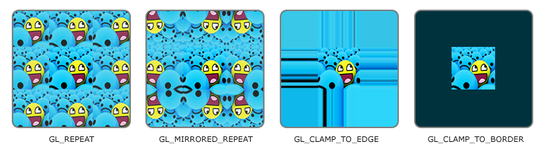
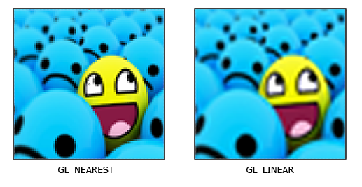
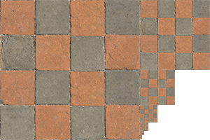

# OpenGL starter code & Study Note
Starter code for OpenGL (including the required libraries) and study note for personal use.  
This study note is not very extensive since I'm not a big fan of making neat notes - I prefer to understand and memorise them.  

It is intended to read the [tutorial](https://learnopengl.com) over and over until I internalise it.


### Table of Contents  
[Getting Started](#getting-started)  
[Theory](#theory)   
[OpenGL](#opengl)


# Getting Started
Download [GLFW](#https://www.glfw.org) and [GLAD](https://glad.dav1d.de). For GLAD, set Profile to Core, gl to version 3.3 and click generate. Watch this [youtube tutorial](https://youtu.be/XpBGwZNyUh0?si=rgaipn1xYPWQxw4p) for the rest of the step.  

Other libraries are not included as they are not needed to run OpenGL. But you can download them here as well. [stb_image.h](https://github.com/nothings/stb/blob/master/stb_image.h), [GLM](https://glm.g-truc.net/0.9.8/index.html)

# Theory
To be added


# OpenGL
### Table of Contents
* [Creating a new window](#creating-a-new-window)  
* [Loading GLAD](#loading-glad)  
* [Window Loop](#window-loop)  
* [Buffers](#buffers)  
* [Shaders](#shaders)  
* [Textures](#textures)  
* [GLSL](#glsl)

## Creating a New Window
Include the libraries for GLAD and GLFW. glad should be included prior to GLFW.  
```cpp
#include <glad/glad.h>
#include <GLFW/glfw3.h>
```
Initialise GLFW and set the major/minor version. The enum for it is `GLFW_CONTEXT_VERSION_#` but not `GLFW_VERSION_#`.

```cpp
glfwInit();

// Do GLFW stuff

glfwTerminate();
```
## Loading GLAD
GLAD must be initialised after a window is set current.
```cpp 
//Make a window current
glfwMakeContextCurrent(window);

//Initialise GLAD afterwards.
gladLoadGLLoader((GLADloadproc)glfwGetProcAddress);
```
Note it is possible to call `gladLoadGL();` instead but it is not recommended. From this point, you can use functions prefixed with `gl`, such as `glViewport` and `glClearColor`.
## Window Loop
On each iteration, swap buffers and process events to prevent the window from freezing.
```cpp
glfwSwapBuffers(window);
glfwPollEvents();
```
The order matters - subsequent draw calls are done on top of the previous ones.
```cpp
//Change the color data and apply it.
glClearColor(vec4);
glClear(GL_COLOR_BUFFER_BIT);

SubsequentDrawingCalls();
```
This results in any drawing calls visible on top of the new colour. If the order was reversed, nothing would be visible but the background colour.

## Buffers
* [Vertex Buffer](#vertex-buffer)
* [Element Buffer](#element-buffer)
* [Vertex Array Buffer](#vertex-array-buffer)


---
### Vertex Buffer
This buffer is where the coordinates of each vertex is stored. It is also known as `Vertex Buffer Object` or `VBO`. In GLAD, it is called `GL_ARRAY_BUFFER`.  
  

Nothing else is done - It is simply a storage for saving vertices data.

---
### Element Buffer
This buffer is where the indices of vertices are stored. This buffer is optional as drawing can be done solely using `Vertex Buffer` and `Vertex Array Buffer`.  
  
When this is used, drawing can be done by specifying the order of drawing, saving resources consequently.  
  
Element Buffer is also known as `Element Buffer Object` or `EBO`. In GLAD, it is called `GL_ELEMENT_ARRAY_BUFFER`  
  
Drawing can be done using `glDrawElements`  
```cpp
void glDrawElements(
        GLenum mode,
        GLsizei count,
        GLenum type,
        const void* indices
    );
```
Where  
* `mode`: Specifies the drawing mode
* `count`: Number of elements to use to draw
* `type`: Data type of the indices, must be `GL_UNSIGNED_BYTE`, `GL_UNSIGNED_SHORT` or `GL_UNSIGNED_INT`.
* `indices`: Pointer to the stored indices.

---
### Vertex Array Buffer
This is the central buffer where `Vertex Buffer` and/or `Element Buffer` is associated and used for drawing.  
  
Once buffers are associated with this buffer, they no longer need to be bound.

```cpp
//After VBO is associated with vertex array buffer

//VBO can be unbound.
glBindBuffer(GL_ARRAY_BUFFER, 0);
```
This buffer needs to be bound when drawing. Others can be unbound at this time.
```cpp
    glBindVertexArray(vertexArrayBuffer);

    //These two don't need to be bound.
    glBindBuffer(GL_ARRAY_BUFFER, 0);
    glBindBuffer(GL_ELEMENT_ARRAY_BUFFER, 0);

    //Do the drawing calls here.
```
Drawing can be done using `glDrawArrays` 
```cpp
void glDrawArrays(GLenum mode, GLint first, GLsizei count);
``` 
where  
* `mode`: Specify the drawing mode
* `first`: Specify the first index of enabled array
* `count`: Number of indices to draw

Vertex Array Buffer is also known as `Vertex Array Object` or `VAO`. In GLAD, functions for this buffer are specified with `VertexArray`  
  
Linking between `VAO` and `VBO` occurs when calling
`glVertexAttribPointer`. This function links the currently-set `VAO` and `VBO` together, so `VAO` must be bound via `glBindBuffer` prior to this function.  
  
It is possible to link multiple `VBO` with a single `VAO` - just call `glVertexAttribPointer` with a different index.  

Linking between `VAO` and `EBO` occurs when `EBO` is bound by `glBindBuffer`. So a `VAO` must be bound prior to calling `glBindBuffer` for `EBO`.

## Shaders
Each shader needs to be sourced and compiled
```cpp
GLuint shader = glCreateShader(GL_SHADER_TYPE);
glShaderSource(shader, no.Shaders, &source, NULL or Offset);
glCompileShader(shader);
```
Once done, they can be attached to a shader program and linked for use.
```cpp
GLuint shaderProgram = glCreateProgram();
glAttachShader(shaderProgram, shader1);
glAttachShader(shaderProgram, shader2);

//Shaders are linked. They can be removed now.
glLinkProgram(shaderProgram);

//Delete the shaders
glDeleteShader(shader1);
glDeleteShader(shader2);
```
Note that compiling shaders can be done after `glLinkProgram` but they must be sourced beforehand.

Once complete, use that program to draw vertices.
```cpp
glUseProgram(shaderProgram);
glBindVertexArray(VAO);

//Do the drawing calls here
```

## Textures
Textures have their own coordinate system where bottom left is `(0,0)` and top right is `(1,0)`. The horizontal axis is `S`, vertical `T` and depth (if 3D texture) `R`.  

  
It is possible to define coordinates larger/smaller than `(1,1)`. If larger than 1, the image will repeat. If smaller, only a subset of the texture will be used.  


  
The behaviour for when coordinates are greater than 1 can be set using `glTexParameteri` or `glTexParameterfv`.
  
```cpp
glTexParameteri(GL_TEXTURE_nD, GL_TEXTURE_WRAP_#, GL_OPTION);
```
Note that for `GL_CLAMP_TO_BORDER`, you would use `glTexParameterfv` instead, specifying the colour of the border.
```cpp
glTexParameteri(GL_TEXTURE_nD, GL_TEXTURE_WRAP_#, GL_CLAMP_TO_BORDER);

//Specify the colours
float borderColour[] = {r,g,b,a};
glTexParameterfv(GL_TEXTURE_nD, GL_TEXTURE_BORDER_COLOR, borderColour);
```

Similarly, you can choose filtering mode for when texture is zoomed in/out.
  
`GL_NEAREST` chooses the closest pixel whereas `GL_LINEAR` chooses the pixel average of neighbouring ones.
```cpp
glTexParameteri(GL_TEXTURE_nD, GL_TEXTURE_MIN/MAX_FILTER, GL_FILERING_OPTION);
```
Mipmap is an image map where subsequent texture is half the size of the previous one. This is used to apply texture on objects that are far.

```cpp
//Generate a mipmap for texture bound to nD.
glGenerateMipmap(GL_TEXTURE_nD);
```
Similar to the filtering option, the same filtering options can be chosen for mipmap.
```cpp
glTexParameteri(GL_TEXTURE_nD, GL_TEXTURE_MIN_FILTER, GL_OPTION);
```
where `GL_OPTION` can be one of the following:  
* `GL_NEAREST_MIPMAP_NEAREST`: Choose the nearest mipmap (`MIPMAP_NEAREST`) and select pixel using the nearest filtering (`GL_NEAREST`)
* `GL_LINEAR_MIPMAP_NEAREST`: Choose the nearest mipmap (`MIPMAP_NEAREST`) and select pixel using the linear interpolation (`GL_LINEAR`)
* `GL_NEAREST_MIPMAP_LINEAR`: Choose the mipmap via linear interpolation (`MIPMAP_LINEAR`) and select pixel using the nearest filtering (`GL_NEAREST`)
* `GL_LINEAR_MIPMAP_LINEAR`: Choose the mipmap via linear interpolation (`MIPMAP_LINEAR`) and select pixel using the linear interpolation filtering (`GL_LINEAR`)


All of the options above only apply for the currently bound texture. So a texture must be bound via `GL_BIND_TEXTURE`.

```cpp
GLuint texture;

//Generate a texture
glGenTexture(GL_TEXTURE_nD, &texture);
//Bind texture data
glBindTexture(GL_TEXTURE_nD, texture);
//Bind data
glTexImagenD(GL_TEXTURE_nD, 0, GL_RGB, width, height, 0, GL_RGB, textureData);
//Generate mipmap
glGenerateMipmap(GL_TEXTURE_nD);

//Do some filtering/repetition options.
//All of them will be applied to the texture data above.
```

`glTexImagenD` has lots of arguments. For `glTexImage2D`, the parameters are as follows:
```cpp
void glTexImage2D(
        GLenum target,
        GLint level,
        GLint internalFormat,
        GLsizei width,
        GLsizei height,
        GLint border,
        GLenum format,
        GLenum type,
        const GLvoid* data
    );
```
where  
* `target`: Specify the target this data will be stored in. Typically it's `GL_TEXTURE_2D` since `glTexImage2D` creates a 2D texture.
* `'level'`: Level of detail number. Typically set to 0.
* `internalFormat`: Format for OpenGL to use. 
* `border`: Must be set to 0 (Literally that's how the official document states)
* `format`: Format of the image data
* `data`: Actual image data  

## GLSL
To be added
